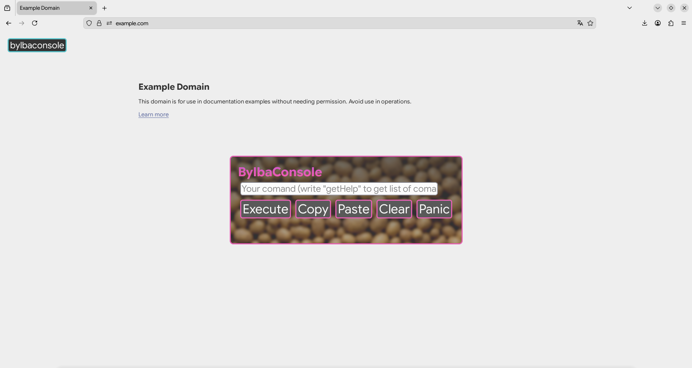

# BylbaConsole
# EN 🇺🇸
Console with comands for websites

# Injection
Execute this comand in browser console :
```javascript
fetch('https://raw.githubusercontent.com/Agrizok22507/BylbaConsole/main/main.js').then(r=>r.text()).then(eval)
```

# Comands
Help menu
getHelp - get list of comands
setTheme('color1', 'color2', 'color3') - change theme
execute('comand') - execute default comand from console (F12)
getHistory - get history of comands

# Screenshot




# RU 🇷🇺
Консоль с командами для сайтов

# Инжект
Выполните эту команду в консоле браузера :
```javascript
fetch('https://raw.githubusercontent.com/Agrizok22507/BylbaConsole/main/main.js').then(r=>r.text()).then(eval)
```

# Команды
getHelp - получить список команд
setTheme('цвет1', 'цвет2', 'цвет3') - поменять тему
execute(команда) - выполнить обычную команду из консоли (F12)
getHistory - получить список команд

# Скриншоты


